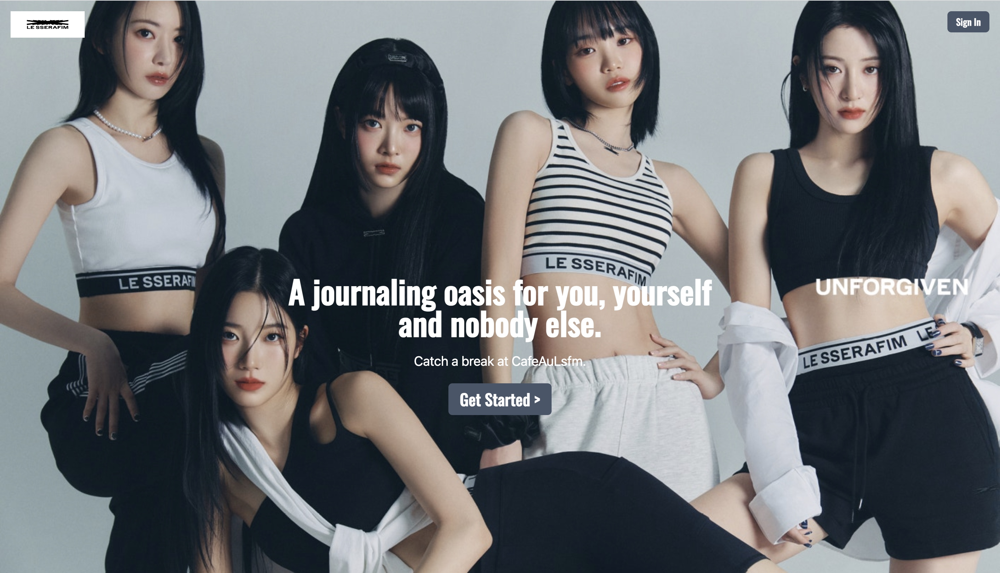

# CafeAuLsfm (a fancafe without noisy people)

## Table of Contents

- [Introduction](#introduction)
- [Features](#features)
- [Deployment](#deployment)
- [Technologies Used](#technologies-used)
- [Getting Started](#getting-started)
- [Project Brief](#project-brief)
- [Challenges](#challenges)
- [Key Learnings](#key-learnings)
- [Future Developments](#future-developments)
- [Acknowledgments](#acknowledgments)

## Introduction

CafeAuLsfm App provides a platform that allows users to be near to the source and far from the noise, making their stanning activities more peaceful. Here, users can practice mindfulness in their stanning activities (stan - to be overzealous over a celebrity), and learn to appreciate their beloved artists with some sense of objectivity...not noise induced obsessiveness ^_^

## Features

- **User-friendly interface:** The app features an intuitive and visually appealing user interface that allows users to navigate easily through the app.
- **User Journal Page:** The core feature of the app is the platform it provides for users to journal and keep track of the various milestones in their fan journey. Here, users can express their thoughts and jot down their memories by creating a Journal Post. A picture, title, description and url for relevant (external) content are accepted to provide the necessary information in a concise manner.
- **Announcement Page (Admin Page):** Admins can help to keep other users up-to-date with the artists by adding posts related to official content produced by the artists and events that they have/or are attending. (same features as the user Journal Posts)
- **Bucket List:** Users can Add or Save things to-do into their Bucket List, so that they can conveniently keep track of their fan activities.

## Deployment

CafeAuLsfm App is deployed on [Render](https://render.com/). You can access it [here](https://cafeaulsfm-i6ia.onrender.com).

## Technologies Used

- React
- Express
- MongoDB
- Node.js
- AWS S3
- Tailwind CSS

## Getting Started

### Wireframes

For the wireframe, truthfully...there is none, but shout out to [NextFit](https://nextfit-app.onrender.com/) and Pinterest! ^_^  

### User Stories

- As a fan with fandom fatigue, I require an app that will let me have a peaceful space to express myself with minimal noise from other people 

- As a fan with fandom fatigue but still wants to keep up with updates on my idols, I seek an app that can help me organise the various fan content available

You can access the Trello board [here](https://trello.com/b/JFeKxIJg/caf%C3%A9-au-lsfm).

### Pitch Deck

there is none :D
but social media without the social? always a big slay.

### App Flow

- **Login Page**
- **Navbar Options:**
1. Home Page
2. My Journal 
3. Cafe Updates
4. My Bucket List
5. Create Journal Post
6. Create Bucket List Card

#### Create Journal Post/ Bucket List Card

- Form to create and store user information in the database (e.g. image, title, description, url).

#### My Journal/Cafe Updates/My Bucket List

- Here information from the database is read and displayed. For My Journal and My Bucket List information from the database, created by the current user, can be add to, deleted and updated.

### Database Relationships

- **One-to-Many (1-M):**
  - One user (userID) can have multiple journal posts (postID).
  - One user (userID) can have multiple bucket list cards (bucketlistItemID).

- **Many-to-Many (M-M):**
  - uh...@.@

## Project Brief

### Technical Requirements

- Be a full-stack MERN application.

- Connect to and perform data operations on a Mongodb database

- Have at least one data entity (Model) in addition to the built-in User model (if using API). If not consuming an API, have at least two data entities (Models) in addition to the built-in User model. Have at least one one-to-many (1:M) and/or one many-to-many (M:M) relationship between entities/models.

- Have full-CRUD data operations across any combination of the app's models (excluding the User model).

- Have suitable validations for the models, React (client) and Express (server)

- Authenticate users using JWT.

- Implement authorization by restricting access to the Creation, Updating & Deletion of data resources

- Be styled such that the app looks and feels similar to apps we use on a daily basis - in other words, it should have a consistent and polished user interface.

- Be deployed online. Presentations must use the deployed application.

### Other Deliverables

A README.md file with these sections (here's a basic template)

- App Title: Contains a description of what the app does and optional background info.

- Screenshot(s): A screenshot of your app's landing page and any other screenshots of interest.

- Technologies Used: List of the technologies used.

- Getting Started: That Includes:

  - A link to the deployed app
  - A link to the Trello board used for the project's planning that includes user stories, wireframes & an ERD.

## Challenges

Creating CafeAuLsfm presented several challenges. Some of the key challenges included:

- **Backend and User Authentication Set-Up:** Setting up backend is ruff...tldr: definitely remember to look through all files...at least once. (vite.config.js was a great start for me- shout out to that one line that reads like 
 proxy: {
      "/api": "http://localhost:3000",
    },
    )

- **User Experience Design:** Ensuring a user-friendly and visually appealing interface that caters to a wide range of fashion preferences and age groups was a design challenge.

## Key Learnings

During the development of CafeAuLsfm, the insights and lessons derived are as such:

- **Debugging is a Necessary Fun (...evil):** to be honest, no part of this project was more rewarding than the debugging process- because it was at the points that i had to seek for answers by myself where my brain actually worked for once to piece together things. solid learning experience, 404/10 would recommend.

## Future Developments

CafeAuLsfm is cosy and comfortable but has capacity for further enhancements and expansions. Some potential areas for future development include:

- **Interactive UI for the Edit (UPDATE) Function:** Editable UI would make for a more seamless user experience.

- **Ability to drag and re-order journal cards in a board:** For user experience (again!...and maybe user is me- because I want that experience for real.)

- **Setting to make the user's board public or private:** Yes, most of the times I like the privacy to fawn over my idols, but I also like to brag (sometimes). iykyk i guess- sorry that was annoying. if you know! you know ~ ^_^ Also, for Social Sharing and Collaboration!

- **Reset Password Function:** no reason, just because. (actually i forgot the passwords to half the accounts i have created- but also i remember, i literally AM the admin~ muahahaha >:D)

## Acknowledgments

- Shoutout to the open-source community for their contributions to the libraries and tools used in this project. (slayed, decimated, thank you for your service- greatly appreciated)
